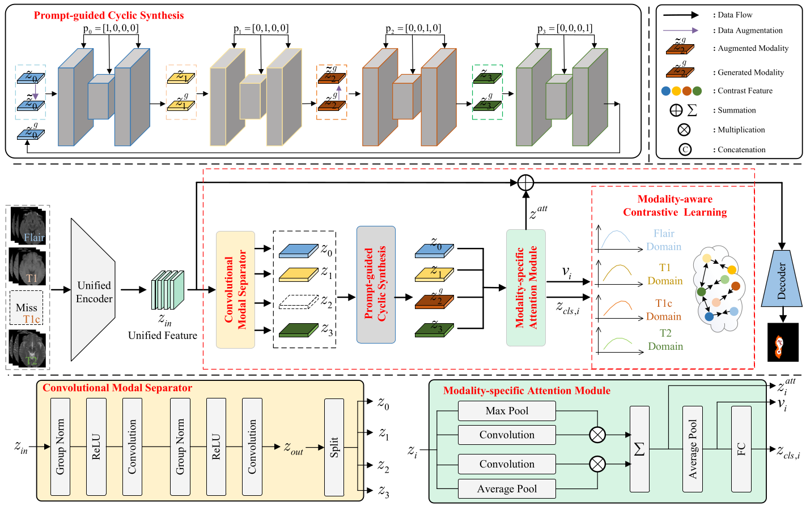

# CLRS
This is the official code for Cyclic Contrastive Representation Learning for Incomplete Multi-modal Medical Image Segmentation.



## Get Started

### Environment requirements
* Python >=3.10
* torch 2.7.0+cu128
* Others packages listed in requirements.txt
### train model
Run shell.sh for training, which supports multi-GPU distributed training.

```
./shell.sh
```


**Manual execute single command**

To run a specific training condition individually, execute the corresponding command from the script. For example:
```
python3 -m torch.distributed.lunach --nproc_per_node=1 --master_port 20081 train.py --gpu 0 --run_times 1 --alpha 0.1 --beta 0.1 --lr 0.0002
```
